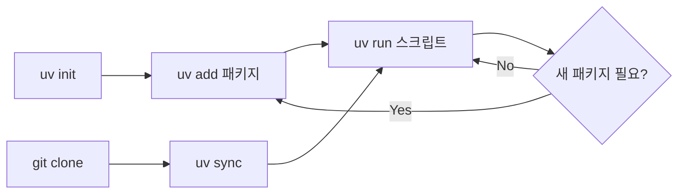

# uv 종속성 관리 가이드 (Python 3.13)

## 핵심 개념

uv는 `pyproject.toml`을 중심으로 종속성을 관리합니다.

| 파일 | 역할 |
|------|------|
| `pyproject.toml` | 프로젝트 메타데이터 + 의존성 선언 (기존 `requirements.txt` 대체) |
| `uv.lock` | 정확한 버전 고정 (자동 생성, 커밋 대상) |
| `.python-version` | 사용할 Python 버전 명시 |
| `.venv/` | 가상환경 (자동 생성, `.gitignore` 대상) |

---

## 1. 프로젝트 초기화

```powershell
# 현재 디렉토리에 Python 3.13 프로젝트 생성
uv init --python 3.13
```

생성되는 파일: `pyproject.toml`, `.python-version`, `main.py`(boilerplate)

> [!TIP]
> 기존 `requirements.txt`가 있다면 초기화 후 마이그레이션 가능 (아래 참고)

---

## 2. 패키지 추가/제거

```powershell
# 패키지 추가 (pyproject.toml에 기록 + 설치)
uv add requests
uv add "fastapi>=0.100"        # 버전 범위 지정
uv add requests httpx          # 여러 개 동시에

# 개발용 의존성 추가 (--dev 그룹)
uv add --dev pytest ruff

# 패키지 제거
uv remove requests

# 현재 pyproject.toml 기반으로 동기화 (lock + install)
uv sync
```

> [!IMPORTANT]
> `uv add`는 자동으로 `uv.lock` 갱신 + `.venv`에 설치까지 한번에 수행합니다.
> `pip install`을 별도로 할 필요가 없습니다.

---

## 3. 기존 requirements.txt 마이그레이션

```powershell
# requirements.txt의 패키지를 한번에 추가
uv add -r requirements.txt
```

이후 `requirements.txt`는 삭제하거나 보관용으로만 유지하면 됩니다.

---

## 4. 스크립트 실행

```powershell
# uv run = 가상환경 활성화 없이 바로 실행
uv run python feat/textGenerator/main.py

# 또는 모듈 실행
uv run python -m feat.textGenerator.main
```

> [!NOTE]
> `uv run`은 `.venv`가 없으면 자동 생성하고, 의존성이 동기화 안 되어 있으면 자동 `sync`합니다.
> 수동으로 `.venv\Scripts\activate` 할 필요 없습니다.

---

## 5. 가상환경 직접 관리 (필요시)

```powershell
# 가상환경 수동 생성 (보통 불필요 - uv sync/run이 자동 생성)
uv venv --python 3.13

# 가상환경 활성화 (IDE 연동 등에서 필요할 때)
.venv\Scripts\activate
```

---

## 6. Lock 파일 관리

```powershell
# lock 파일만 갱신 (설치는 안 함)
uv lock

# lock 파일 기반으로 설치만
uv sync

# 의존성 트리 확인
uv tree
```

---

## 7. 일반적인 워크플로우



### 새 프로젝트 시작
```powershell
uv init --python 3.13
uv add fastapi uvicorn
uv run python main.py
```

### 기존 프로젝트 클론 후
```powershell
git clone <repo>
cd <repo>
uv sync              # pyproject.toml + uv.lock 기반으로 환경 복원
uv run python main.py
```

---

## 8. pyproject.toml 예시

```toml
[project]
name = "tmp-pyserver"
version = "0.1.0"
description = "My Python project"
readme = "README.md"
requires-python = ">=3.13"
dependencies = [
    "fastapi>=0.100",
    "requests>=2.31",
]

[dependency-groups]
dev = [
    "pytest>=8.0",
    "ruff>=0.4",
]
```

---

## pip 명령어 대응표

| pip | uv | 비고 |
|-----|-----|------|
| `pip install pkg` | `uv add pkg` | pyproject.toml에도 기록 |
| `pip install -r requirements.txt` | `uv add -r requirements.txt` | 마이그레이션용 |
| `pip uninstall pkg` | `uv remove pkg` | |
| `pip freeze` | `uv pip freeze` 또는 `uv tree` | |
| `pip list` | `uv pip list` | |
| `python script.py` | `uv run python script.py` | 가상환경 자동 활성화 |
| `python -m venv .venv` | `uv venv` | 보통 불필요 |

> [!CAUTION]
> `uv pip install`도 사용 가능하지만, 이는 `pyproject.toml`에 기록하지 않습니다.
> 종속성 관리를 위해서는 반드시 `uv add`를 사용하세요.
